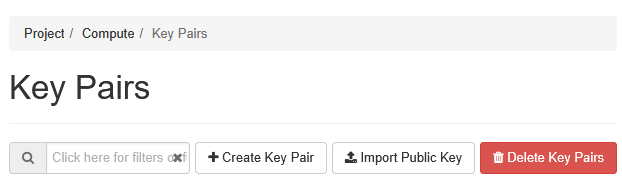
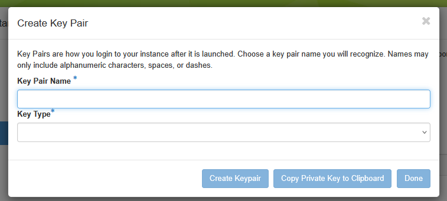
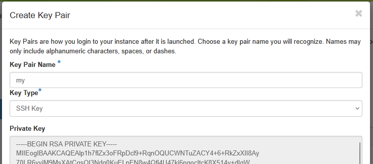

# Observatory Reproduction on Chameleon Trovi

## Overview
This repository contains the artifact for the **Observatory Trovi** project on Chameleon Cloud.  
It demonstrates how to configure secure access to a Chameleon compute instance, connect to the instance remotely, and run a Jupyter-based workflow for Observatory-style experiments.

The goals of this artifact are to:

- Demonstrate how the **Trovi workflow** operates on Chameleon infrastructure
- Show how Chameleon SSH key pairs are created and used for secure authentication
- Explain how to connect to a remote compute instance and run notebooks there
- Provide a minimal, reproducible example using an Observatory notebook

> **Note**: Running the notebook directly inside Chameleon’s web-based Jupyter interface is **not recommended**, as it has limited memory and performance.  
> Instead, we connect from a local machine (or Trovi interface) to a remote Chameleon instance via SSH and execute the notebook there.


### Repository Structure
```text
trovi_observatory/
│── observatory_reproduction.ipynb   # Main Observatory reproduction notebook
│── my_key.pem                       # SSH private key (user-generated)
│── README.md                        # This documentation
```
* **observatory_reproduction.ipynb**: The main notebook demonstrating the Observatory workflow and remote execution setup.
* **my_key.pem**: Your SSH private key file (not included by default; you must create it).
* **silent_eval.py**: A helper script used by the notebook for evaluations.


## Jupyter Notebook Overview
The core of this repository is the `observatory_reproduction.ipynb` notebook.

It is organized into the following logical sections:

1. **Environment Setup**: Install dependencies and configure paths on the remote machine.
2. **Chameleon Server Connection**: Use an SSH private key to authenticate and connect to a Chameleon compute instance.
3. **Data Loading & Preprocessing**: Launch Jupyter on the remote instance and connect to it from a local browser.
4. **Trovi Method Execution**: Run the Observatory example code and verify outputs.
5. **Results and Cleanup**: Inspect results and properly terminate the remote session.

> **Important**: You won’t start the notebook via Chameleon’s internal Jupyter interface or your local machine. Instead, you'll connect to the remote instance using SSH + your key, then start the notebook server on the remote machine.

## Remote Execution Workflow
Chameleon’s interactive notebook environment has limits on memory, CPU, and GPU availability, thus running heavy experiments there may fail. Instead, we:
1. SSH into a powerful instance
2. Launch Jupyter inside the instance
3. Connect the remote server notebook to our local browser

This approach ensures better performance and full control.

### SSH Key Pair Requirement
To securely connect your local machine to a Chameleon compute instance, you must generate an **SSH key pair**:
1. In the Chameleon dashboard, go to the `Key Pairs` tab under `Compute` tab.
2. Click `Create Key Pair`. 



3. Enter a name and choose `SSH Key` as the key type. In the notebook code, we default to using the key pair named “my_key”. You can also name your key my_key for convenience, otherwise you will need to update the key name in the code to match your chosen name.



4. Click `Create KeyPair`

5. A `private key` file will be shown once, save it immediately! In the repository, you save the private key as `my_key.pem`.



> Important:
> * The dashboard only shows the private key once. If you lose it, Chameleon cannot recover it.
> * In our code, when we prepare to connect to a remote Chameleon instance, we explicitly select and attach the public SSH key (identified by the key-pair name, e.g., `my_key`) to the target compute instance. This step installs the public key on the remote machine and registers it in the instance’s authorized SSH keys. 
> * This explicit key attachment ensures that the remote instance will accept SSH connections associated with the selected key pair.
> * The private key remains on your local machine or Jupyter interface (stored as `my_key.pem`) and is used by the SSH client to authenticate against the remote instance.
> * Always keep your private key safe, never share it.


This SSH tunnel allows:
* Launching Jupyter Notebook remotely
* Transferring data
* Running experiments without manual login

Check the **Key Pair** section in the [Documentation](https://chameleoncloud.readthedocs.io/en/latest/getting-started/) for more details. 


### SSH connection

Here is an example ssh command that restrict key permissions and connect us securely to the remote machine. 

```bash
chmod 600 my_key.pem

ssh -i my_key.pem your_username@remote_ip_address

```

In the notebook, we do the same via Python code so that everything is automated.